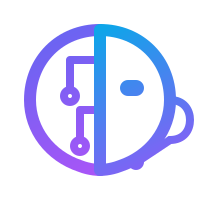

<div align="center">
  
  <h1 align="center">BrainDesk AI</h1>
  <p align="center"><strong>Enterprise Multi-Tenant RAG SaaS Platform</strong></p>

  <p align="center">
    
    
    
    
    
  </p>
  
  <p align="center">
    
    
  </p>
</div>

---

## 🌟 Overview

**BrainDesk** is an enterprise-grade RAG (Retrieval-Augmented Generation) Chatbot SaaS platform. It enables business owners to instantly deploy intelligent, 24/7 AI support agents to their websites without any coding.

Simply crawl your website URLs or upload PDF documents (menus, FAQs, internal handbooks), and BrainDesk will generate a brandable, embeddable AI chat widget. 

### 🔐 Zero-Leakage Architecture
The platform features **complete multi-tenant data isolation**. The AI strictly answers customer questions based *only* on the documents uploaded for that specific business (`widget_id`), entirely preventing cross-tenant data leakage and hallucinations.

---

## ✨ Key Features

- **Futuristic UI Dashboard**: Cyber-glowing glassmorphic design built with React, Vite, and custom CSS.
- **Tenant Access Control**: "God Mode" platform admin dashboard vs. isolated client workspaces.
- **Smart Web Crawler**: Instantly scrape and index any website (including Next.js/React SPAs).
- **PDF Knowledge Base**: Upload employee handbooks, pricing guides, or FAQs.
- **Unanswered Intelligence Analytics**: Automatically track and group questions the AI couldn't answer.
- **Live AI Playground**: Test your business's AI responses safely inside the dashboard sandbox.
- **Widget Customization Studio**: Brand your bot's color, title, and welcome greeting instantly.

---

## 🛠️ Architecture & Tech Stack

### Frontend Application
- **Framework:** React + Vite (TypeScript)
- **Styling:** Vanilla CSS (Tailored Design System, Glassmorphism, CSS Modules)
- **Routing:** React Router v6

### Backend API
- **Framework:** Python, FastAPI
- **AI Orchestration:** LangChain
- **LLM Engine:** Groq API (`llama-3.3-70b-versatile`)
- **Embeddings:** HuggingFace (`all-MiniLM-L6-v2`)
- **Vector Database:** ChromaDB (Local, Open-Source Vector Storage with Metadata Filtering)

### Embeddable Widget
- **Core:** Vanilla JavaScript & CSS overlay script (Zero dependencies)

---

## 🚀 Getting Started (Local Development)

### 1. Backend Setup
Navigate to the backend directory and install the requirements:
```bash
cd backend
pip install -r requirements.txt
```

Ensure your `.env` file inside `backend/` contains your Groq API key:
```env
GROQ_API_KEY="your_groq_api_key_here"
```

Start the FastAPI backend server:
```bash
cd backend
python -m uvicorn app.main:app --reload
```
- **Swagger UI Docs:** http://127.0.0.1:8000/docs
- **Health Check:** http://127.0.0.1:8000/health

### 2. Frontend Dashboard Setup
```bash
cd frontend
npm install
npm run dev
```

---

## 📌 How to Embed Chat Widget into Any Website (100% Working Guide)

### Option A: Standard HTML / PHP / WordPress / Webflow Websites
Paste this single `<script>` snippet right before the closing `</body>` tag of your website:

```html
<!-- BrainDesk AI Chat Widget -->
<script 
  src="http://127.0.0.1:8000/static/sitebrain-widget.js" 
  data-widget-id="your_project_id"
  data-bot-name="BrainDesk Assistant" 
  data-color="#6366f1" 
  data-greeting="Hi there! How can I help you today?" 
  data-position="bottom-right"
  data-require-lead="true">
</script>
```

### Option B: React.js / Next.js Applications
In your `index.html` (or Next.js `app/layout.tsx` / `pages/_document.tsx`), add the script tag using Next.js `Script` or standard tag:

```tsx
import Script from 'next/script';

export default function RootLayout({ children }: { children: React.ReactNode }) {
  return (
    <html lang="en">
      <body>
        {children}
        <Script 
          src="http://127.0.0.1:8000/static/sitebrain-widget.js"
          data-widget-id="your_project_id"
          data-bot-name="BrainDesk Assistant"
          data-color="#6366f1"
          data-greeting="Hi there! How can I help you today?"
          data-position="bottom-right"
          data-require-lead="true"
          strategy="afterInteractive"
        />
      </body>
    </html>
  );
}
```

---

## 🤝 Contributing & License
Part of an advanced AI SaaS portfolio build. Contributions and feature requests are welcome! 

Distributed under the MIT License.


## 🚀 Production Deployment (Docker)

SiteBrain AI is fully containerized and ready to be deployed to any VPS (like Oracle Cloud, AWS EC2, or DigitalOcean) using Docker.

### How to Deploy:
1. Clone this repository onto your server.
2. Create a `.env` file in the root directory and add your `GROQ_API_KEY`:
   ```bash
   GROQ_API_KEY=your_key_here
   ```
3. Run the automated deployment script:
   ```bash
   chmod +x deploy.sh
   ./deploy.sh
   ```

Docker Compose will automatically build the Frontend (React + Nginx) and Backend (FastAPI + ChromaDB) containers, network them together, and expose the application on Port 80. The application will automatically restart if the server reboots!
